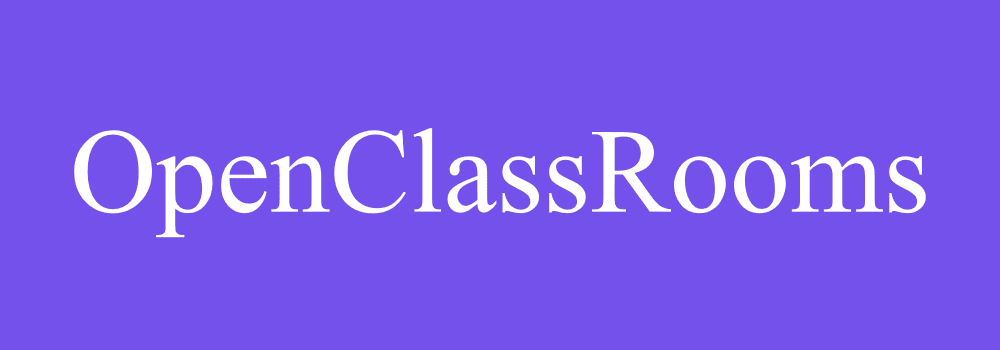
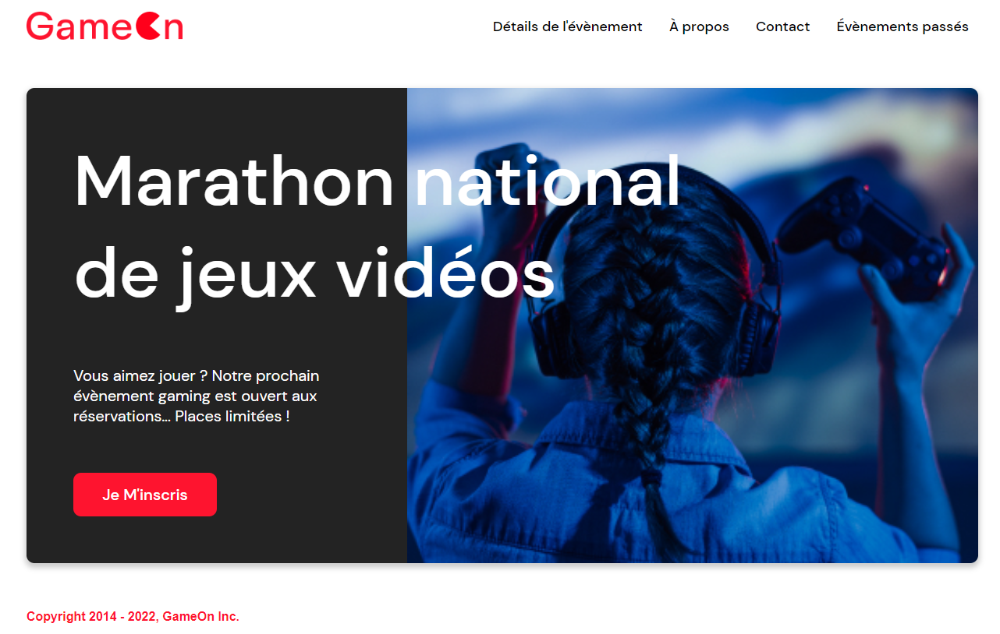
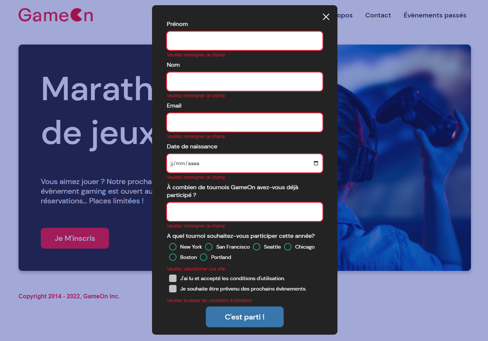

# Formation Développeur d'application - JavaScript React

## 📎 Projet 4 : Créez une landing page avec Javascript





## Technologies :
- HTML
- CSS
- JS

 

 ## Tester le projet :

```terminal
git clone https://github.com/Cyril-Develop/GameOn.git
```